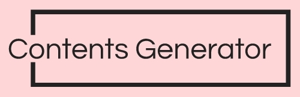

  

 

<h1 align="center">Table of Contents Generator</h1>

A repository to hold code for a markdown file table of contents generator available on [GitHub Pages](https://neoreuvenla.github.io/table-of-contents/).